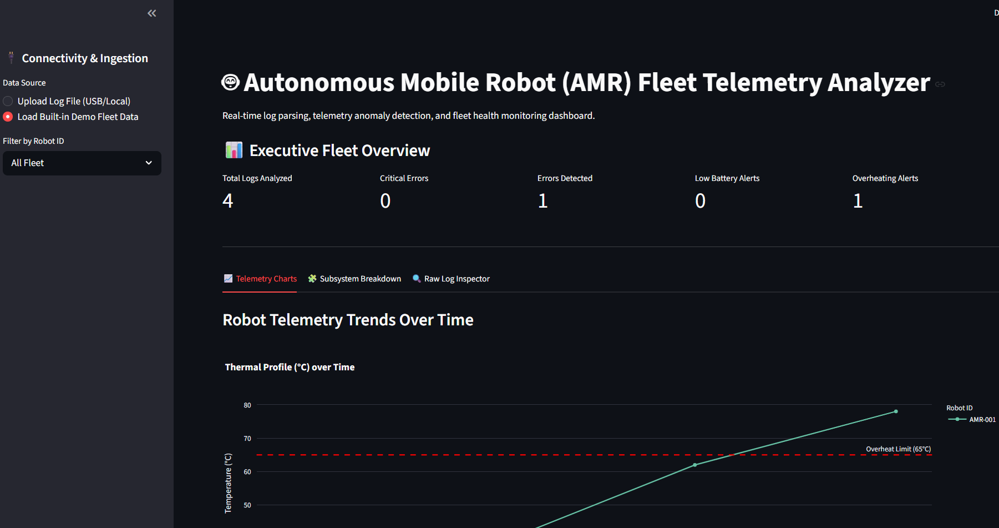
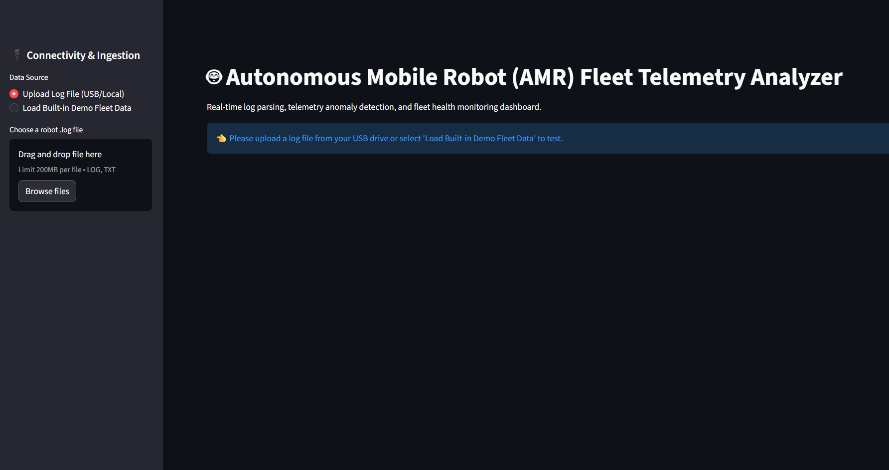
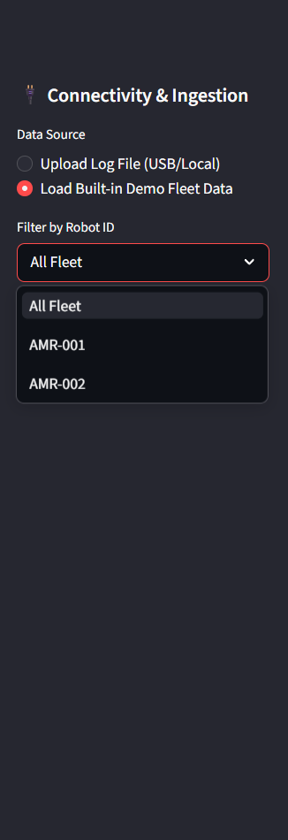
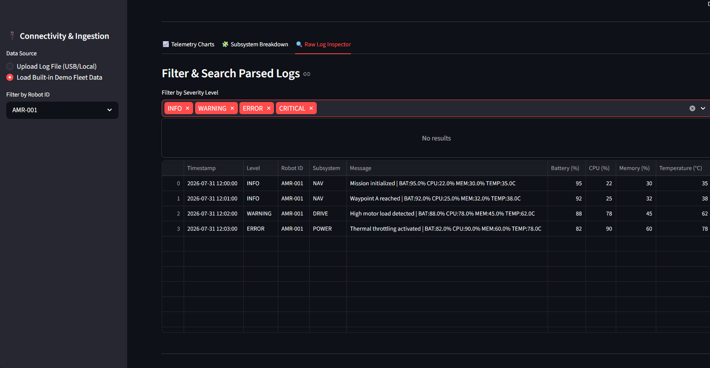

# 🤖 Autonomous Mobile Robot (AMR) Telemetry Dashboard & Log Analyzer


An enterprise-grade, end-to-end telemetry analysis platform built for autonomous robot fleets. This application parses raw hardware logs, detects critical subsystem anomalies (e.g., thermal throttling, voltage drops), and visualizes fleet health in a real-time, interactive dashboard. 

## ⚙️ System Workflow

The architecture is designed to handle the complete lifecycle of telemetry data, from raw ingestion to visual analytics:

1. **Data Ingestion:** Users drag-and-drop raw log files (TXT, CSV, JSON) generated by robot hardware, or connect to the built-in demo stream.
2. **Parsing Engine:** A high-performance Regular Expression (Regex) parser extracts timestamps, log severity, subsystem tags, and physical telemetry (Battery, CPU, Memory, Temp).
3. **Analytical Engine:** The backend computes uptime/downtime gaps, flags mathematical anomalies (e.g., Temp > 65°C), and scores subsystem health.
4. **Dashboard Visualization:** Processed Pandas DataFrames are piped into a responsive Streamlit frontend, rendering interactive Plotly charts and data grids.

---

## 📸 Dashboard Visual Tour

### 1. Executive Fleet Overview & Telemetry Trends
Real-time tracking of hardware thermal profiles and battery drainage over time using interactive Plotly charts. Includes dynamic metric cards for critical errors and anomaly alerts.



### 2. Flexible Data Ingestion
The connectivity panel allows for instant drag-and-drop log file uploads directly from physical USB drives or local disks.



### 3. Fleet-Wide & Individual Robot Tracking
Isolate specific hardware units. Filter the entire analytics engine by individual Robot IDs (e.g., AMR-001) to diagnose unit-specific faults.



### 4. Raw Log Inspector
A drill-down data grid allowing engineers to filter by severity level (INFO, WARNING, ERROR, CRITICAL) and search for specific error messages in the parsed logs.



---

## ✨ Key Features

* **Automated Anomaly Detection:** Programmatic threshold tracking for hardware safety limits (battery levels, overheating limits).
* **Downtime Analytics:** Computes fleet heartbeat loss and tracks the exact duration of system offline events.
* **Multi-Format Support:** Read engines capable of parsing unstructured text logs, CSVs, and strict JSON telemetry payloads.
* **Dual Interface:** Fully functional as both an interactive web application and a headless command-line interface (CLI) for CI/CD pipelines.

---

## 🛠️ Technology Stack

* **Core Language:** Python 3.10+
* **Frontend Framework:** Streamlit
* **Data Manipulation:** Pandas
* **Interactive Visualization:** Plotly (Express & Graph Objects)
* **Automated Testing:** Pytest

---

## 🚀 Getting Started

### 1. Clone the Repository
```bash
git clone [https://github.com/yourusername/Robot-Log-Analyzer.git](https://github.com/yourusername/Robot-Log-Analyzer.git)
cd Robot-Log-Analyzer